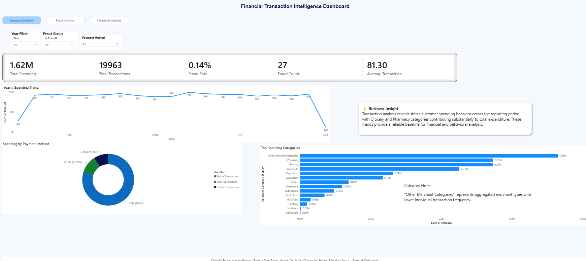
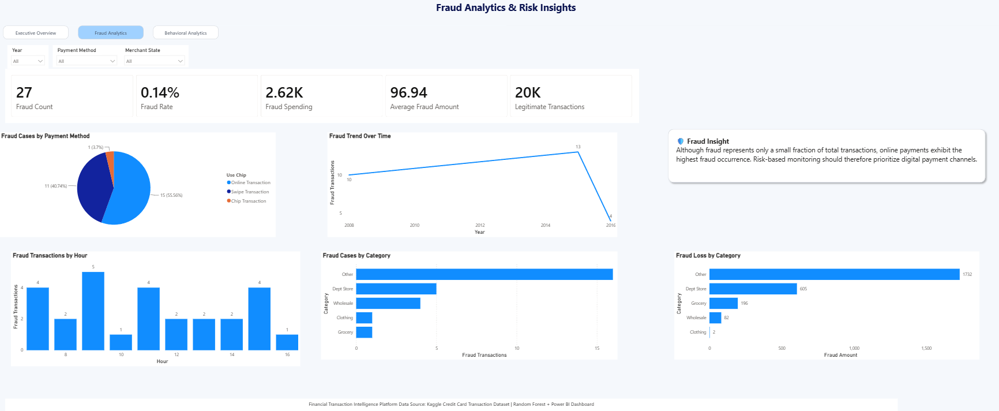
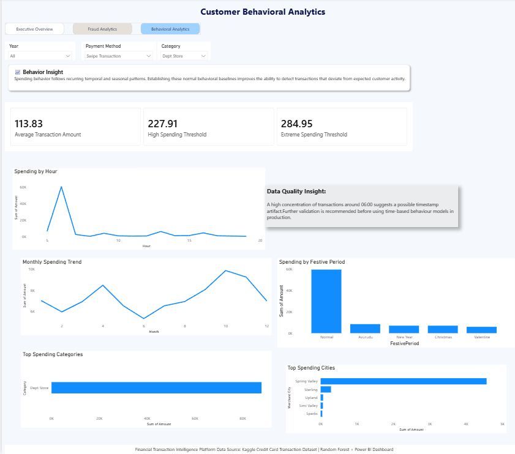

## Project Overview

FinancialIQ is an end-to-end Financial Transaction Intelligence Platform that combines Machine Learning, Explainable AI, Business Intelligence, and Web Technologies to analyze financial transactions, detect fraudulent activities, and discover customer spending patterns.
The project processes nearly 20,000 credit card transactions, performs data cleaning and feature engineering, develops machine learning models for fraud detection, explains model decisions using SHAP, deploys predictions through a Flask REST API, and provides interactive business insights through a Power BI dashboard.
The platform demonstrates how data science can support both:
Real-time fraud monitoring
Business decision-making through interactive analytics by combining predictive modeling with explainable insights.

Power BI dashboard previews-
Executive Overview-
Fraud Analytics-
Customer Behavioral Analytics-

## Dataset Overview

The dataset contains historical credit card transactions used to demonstrate financial analytics and fraud detection techniques.

Dataset Statistics
Total Transactions: 19,963
Original Features: 15
Time Period: 2002 - 2020
Target Variable: Fraud Label
Dataset Includes-Transaction amount,Transaction date,Merchant information,Merchant Category Code (MCC),Payment method,Geographic information,Fraud indicators
The original dataset is not included in this repository due to privacy and licensing considerations.The project was developed using this dataset to demonstrate a complete financial intelligence workflow including:
 Data preprocessing
 Exploratory analysis
 Machine learning
 Explainable AI
 Dashboard development

## Data Cleaning and Feature Engineering

The raw dataset required preprocessing before analysis and model development.
Data Cleaning Steps
-------------------
The following transformations were performed:
Amount Processing
Removed currency symbols from the Amount column.
Converted transaction amounts into numerical format.
Date Processing
-Combined:Year,Month,Day into a single transaction date column.
-Missing Value Handling
  Missing values were handled as follows:
  Merchant State-Replaced with "Unknown"
  Zip Code-Replaced with 0
  Errors-Replaced with "No Error"
  Duplicate Removal-Duplicate transaction records were removed to improve data quality.

## Feature Engineering

Additional features were created to capture customer behavior and transaction patterns.

Time-Based Features
Hour
Day of Week
Month
Transaction Behavior Features
Festive Period Classification
Merchant Category Mapping from MCC codes
These features helped improve fraud detection performance and enabled deeper business analysis.

## Exploratory Data Analysis (EDA)

Exploratory Data Analysis was performed to understand transaction behavior, spending patterns, and fraud characteristics within the dataset.

Key Transaction Insights
Overall Transaction Statistics
Total Transactions: 19,963
Total Spending: $1.62M
Average Transaction Value: $81.30

The dataset shows relatively stable spending behavior across the analyzed period, with no major long-term growth or decline patterns.

## Category Spending Analysis

Merchant categories were analyzed to identify customer spending preferences.

Highest Spending Categories

The highest total spending was observed in:

Other Categories
Pharmacy
Grocery
Wholesale
Department Stores
Category Insights
Grocery and Pharmacy represent frequent customer spending behavior.
Wholesale transactions contain higher average transaction values.
Merchant category information provides useful behavioral signals for fraud detection.

## Fraud Analysis

Fraud transactions are extremely rare in this dataset.

Fraud Statistics
Fraud Transactions: 27
Fraud Rate: 0.135%

Because fraudulent transactions represent a very small percentage of the dataset, fraud detection becomes a highly imbalanced classification problem.

## Fraud Behavior Insights
Payment Method Analysis

Fraud rates vary significantly depending on payment method.

Key findings:

Online transactions show the highest fraud rate (~1.14%).
Swipe transactions show moderate fraud activity.
Chip transactions show the lowest fraud rate (~0.04%).

This suggests online transactions require stronger monitoring and verification mechanisms.

## Time-Based Analysis

Transaction timing patterns were analyzed using hour-based and day-based features.

Key findings:

Spending patterns vary throughout the day.
A significant transaction concentration appears around 06:00, requiring further investigation as a potential data quality issue.
Day-of-week spending remains relatively consistent.

## Seasonal Spending Analysis

Customer spending patterns were analyzed across seasonal periods.

Higher spending activity was observed during:

New Year
Christmas
Avurudu seasonal period

These patterns demonstrate how seasonal events influence financial behavior.

## Geographic Analysis

Geographic transaction patterns were explored using merchant location information.

Key observations:

Spending is concentrated in several cities.
Online transactions contribute significantly to overall activity.
Location-based behavior can provide additional fraud detection signals.

## Fraud Detection Model
The main machine learning objective of FinancialIQ is detecting potentially fraudulent transactions.

The dataset contains:
19,963 transactions
Only 27 fraudulent transactions

This creates a severe class imbalance problem.

A model predicting every transaction as legitimate could achieve approximately 99.8% accuracy, but it would fail to detect fraud.

Therefore, accuracy was not considered a suitable evaluation metric.

## Machine Learning Approach

The following workflow was implemented:

Selected transaction features available during prediction.
Encoded categorical variables.
Applied stratified train-test splitting.
Used SMOTE only on training data to handle class imbalance.
Trained multiple classification models.
Compared performance using ROC-AUC and fraud detection metrics.

## Features Used

The fraud detection model uses the following features:

Transaction Amount
Transaction Hour
Merchant Category Code (MCC)
Payment Method
Merchant State
Error Status
Month
Day of Week

## Models Evaluated

Three machine learning algorithms were compared:

Logistic Regression
Random Forest
XGBoost
Model Performance
Model	             Precision  	Recall	     F1-Score	ROC-AUC
Logistic Regression    0.003	          0.400	      0.006	 0.8410
Random Forest	   0.250	          0.200	      0.222	 0.9809
XGBoost	             0.200	          0.200	      0.200          0.9342

Selected Model
Random Forest was selected as the final fraud detection model because it achieved the highest ROC-AUC score.

## Model Evaluation

The final model achieved:

ROC-AUC: 0.9809
Precision: 0.25
Recall: 0.20

ROC-AUC was selected as the primary evaluation metric because the dataset contains very few fraud examples.

## Feature Importance

The Random Forest model identified the following features as the strongest fraud indicators:

Transaction Hour
Merchant Category Code (MCC)
Merchant State
Payment Method
Month
Transaction Amount
Day of Week
Error Status

## Business Value

The fraud detection model can support financial monitoring by:

Prioritizing suspicious transactions.
Assisting manual fraud investigations.
Identifying risky transaction patterns.
Supporting real-time fraud screening systems.

## Model Limitations

Although the model achieved strong ROC-AUC performance, several limitations exist:

Only 27 fraud cases are available in the dataset.
Test evaluation contains very few fraud examples.
Precision and recall values are sensitive to individual predictions.
The dataset represents a single-user transaction history and is not suitable for direct production deployment.

A production system would require:

Larger multi-user datasets.
Continuous model retraining.
Real-time transaction streams.
Probability calibration.

## Model Explainability with SHAP

Machine learning models can be difficult to interpret. To improve transparency, SHAP (SHapley Additive exPlanations) was used.

SHAP explains how each feature contributes to individual predictions and overall model behavior.

## SHAP Implementation

The following steps were performed:

Loaded the trained Random Forest model.
Applied the same preprocessing pipeline used during training.
Generated explanations for a sample of transactions.
Calculated global feature importance.
Created SHAP visualizations.

## SHAP Outputs

The analysis produced:

Feature Importance Plot

Shows the overall importance of each feature in fraud predictions.

Output:

09_shap_bar.png

## SHAP Summary Plot

Shows:

Feature importance ranking.
Whether features increase or decrease fraud risk.
Distribution of feature impact.

Output:

10_shap_dot.png

## Flask Application (Deployment Layer)

To make the machine learning model usable outside the development environment, a Flask-based web application was developed.

Flask acts as the backend layer that connects:
Machine learning models
Processed transaction data
Interactive web interfaces

The application allows users to access financial insights and perform fraud predictions through API endpoints.

## Flask Application Features

The Flask application provides two main capabilities:

1. Financial Analytics Dashboard

Provides financial summaries including:

Total transactions
Total spending
Average transaction value
Fraud statistics
Category-level analysis
Spending trends

2. Fraud Detection API

The application accepts transaction details and returns:

Fraud prediction
Risk probability
Final classification result

Example workflow:

User Transaction Input
          |
          ▼
Flask API
          |
          ▼
Machine Learning Model
          |
          ▼
Fraud Risk Prediction
Flask API Routes
/

Loads the main dashboard interface.

/summary

Returns key financial metrics:

Total transactions
Total spending
Average transaction amount
Fraud count
Fraud rate
Selected machine learning model
/insights

Provides automated business insights:

Highest spending category
Fraud-prone payment methods
Peak spending periods
Seasonal trends
/chart_data

Provides structured data for visualization:

Yearly spending trends
Category spending
Payment method analysis
Seasonal spending patterns
/predict_fraud (POST)

Accepts transaction information and returns fraud assessment.

Input Example
{
  "amount": 250,
  "hour": 23,
  "payment_method": "Online",
  "merchant_category": "Electronics"
}
Output Example
{
  "prediction": "Fraud",
  "risk_score": 0.82
}

## Interactive Web Dashboard

A browser-based financial intelligence dashboard was developed using:

HTML5
CSS3
Bootstrap 5
JavaScript
Chart.js
Flask REST API

## Dashboard Features
Financial Overview

Displays:

Total Transactions
Total Spending
Average Transaction Value
Fraud Rate
Model Performance

## Interactive Visualizations

Includes:

Yearly spending trends
Spending by merchant category
Fraud distribution by payment method
Seasonal spending patterns

## Fraud Prediction Interface

Users can enter transaction details and receive:

Fraud prediction
Risk score
Model-based decision output

## Power BI Analytics Dashboard

The FinancialIQ Power BI dashboard provides interactive business intelligence insights from transaction data.

The dashboard focuses on:

Financial overview
Fraud monitoring
Customer behavioral analysis
Dashboard Pages

1. Executive Overview

Provides a high-level summary of financial activity.

Key Metrics
Total transactions
Total spending
Average transaction value
Fraud rate
Visualizations
Spending trends over time
Payment method distribution
Top spending categories
Transaction summary

2. Fraud Analytics

Focuses on identifying suspicious transaction patterns.

Analysis Includes
Fraud cases by payment method
Fraud trends over time
Fraud distribution by hour
Fraud category analysis
Fraud loss analysis

3. Customer Behavioral Analytics

Analyzes normal customer spending behavior.

Insights Include
Hourly spending patterns
Weekly transaction trends
Seasonal spending behavior
Merchant category analysis
Geographic spending distribution

Technologies Used
Machine Learning
Python
Pandas
NumPy
Scikit-learn
XGBoost
Imbalanced-learn (SMOTE)
SHAP
Backend
Flask
REST API
JSON
Frontend
HTML5
CSS3
Bootstrap 5
JavaScript
Chart.js
Business Intelligence
Microsoft Power BI
DAX
Data Modeling
Interactive Visualization

## Key Findings
Online transactions showed the highest fraud rate compared to other payment methods.
Transaction hour and merchant category were important indicators of fraudulent activity.
Random Forest achieved the strongest fraud detection performance among evaluated models.
Spending behavior remained relatively stable across the analyzed period.
Seasonal events such as New Year, Christmas, and Avurudu showed increased spending activity.
Explainable AI using SHAP improved understanding of model decisions.
 

## Future Improvements

Future enhancements planned for FinancialIQ include:

Machine Learning Improvements
Train models using larger multi-user datasets.
Apply advanced anomaly detection techniques.
Perform probability calibration.
Implement real-time fraud streaming.
Dashboard Improvements
Add customer segmentation.
Add predictive analytics pages.
Add automated anomaly alerts.
Integrate live transaction monitoring.
Deployment Improvements
Deploy Flask API using cloud services.
Containerize application using Docker.
Implement CI/CD pipeline.
Add authentication and security controls.
License

This project is developed for educational and portfolio purposes.
The dataset used in this project is not included due to privacy and licensing restrictions.
You are free to explore the implementation, learning concepts, and techniques demonstrated in this repository.
